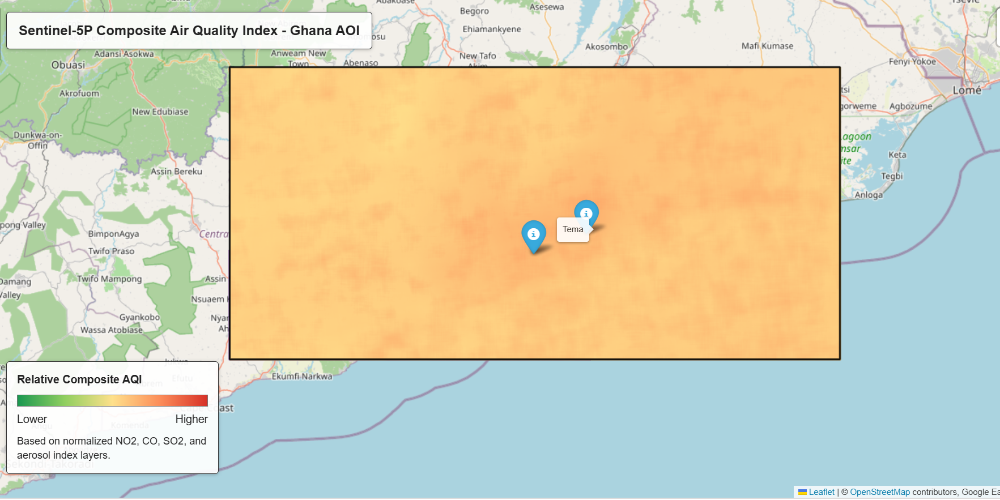

# Air Quality Assessment in Ghana Using Sentinel-5P

This project uses Google Earth Engine satellite data to assess air quality over a selected area of Ghana. It processes Sentinel-5P pollutant layers and combines them with a weighted overlay method to produce a composite air quality index.



## Live Map

GitHub Pages URL after enabling Pages from the repository settings:

`https://adhinortey-dev.github.io/ghana-air-quality-sentinel5p/`

The root page redirects to the exported interactive Folium map in `outputs/ghana_air_quality_map.html`.

## Research Question

How can Sentinel-5P satellite data and weighted overlay analysis be used to assess and map relative air quality patterns in selected urban and industrial areas of Ghana?

## Project Overview

The workflow analyzes four atmospheric indicators:

- Nitrogen dioxide (`NO2`)
- Carbon monoxide (`CO`)
- Sulfur dioxide (`SO2`)
- Aerosol index as a proxy indicator for fine particulate pollution

Each pollutant layer is filtered by date, clipped to the study area, normalized, classified, weighted, and combined into a final air quality index layer.

## Results

The project generated an interactive composite air quality index map for a selected Ghana study area. The result shows relative air quality patterns derived from normalized NO2, CO, SO2, and aerosol index layers.

The map includes reference markers for Accra and Tema to support interpretation around major urban and industrial locations. The output should be interpreted as a relative composite pollution index, not an official regulatory AQI product.

## Key Achievement

This project demonstrates a reproducible Python workflow for acquiring Sentinel-5P atmospheric data from Google Earth Engine, processing multiple pollutant indicators, applying weighted overlay analysis, and exporting the result as an interactive web map.

## Study Period

January 1, 2023 to January 31, 2024

## Tools Used

- Python
- Google Earth Engine
- Folium
- Sentinel-5P
- Weighted overlay analysis

## Repository Structure

```text
.
|-- src/
|   `-- air_quality_assessment.py
|-- figures/
|   `-- composite_aqi_map.png
|-- outputs/
|   `-- ghana_air_quality_map.html
|-- .gitignore
|-- index.html
|-- LICENSE
|-- README.md
`-- requirements.txt
```

## How To Run

Install the required packages:

```bash
pip install -r requirements.txt
```

Run the script:

```bash
python src/air_quality_assessment.py
```

The first run may ask you to authenticate with Google Earth Engine. If Earth Engine requires a Google Cloud project, set the project ID before running.

PowerShell example:

```powershell
$env:EE_PROJECT="your-earth-engine-project-id"
python src/air_quality_assessment.py
```

After a successful run, the script saves an interactive map as:

```text
ghana_air_quality_map.html
```

## Methodology

1. Define the Ghana area of interest with a polygon.
2. Load Sentinel-5P pollutant image collections from Google Earth Engine.
3. Filter each collection by date and calculate the mean pollutant surface.
4. Normalize each pollutant layer to a 0-1 scale.
5. Apply pollutant weights:
   - `NO2`: 0.4
   - `CO`: 0.2
   - `SO2`: 0.2
   - Aerosol index: 0.2
6. Combine weighted normalized layers into a continuous composite air quality index.
7. Visualize individual pollutant layers and the final index on an interactive map.

## Notes

This public version contains the cleaned source code and project explanation. Original academic submission documents were not included because they contain personal student information.
